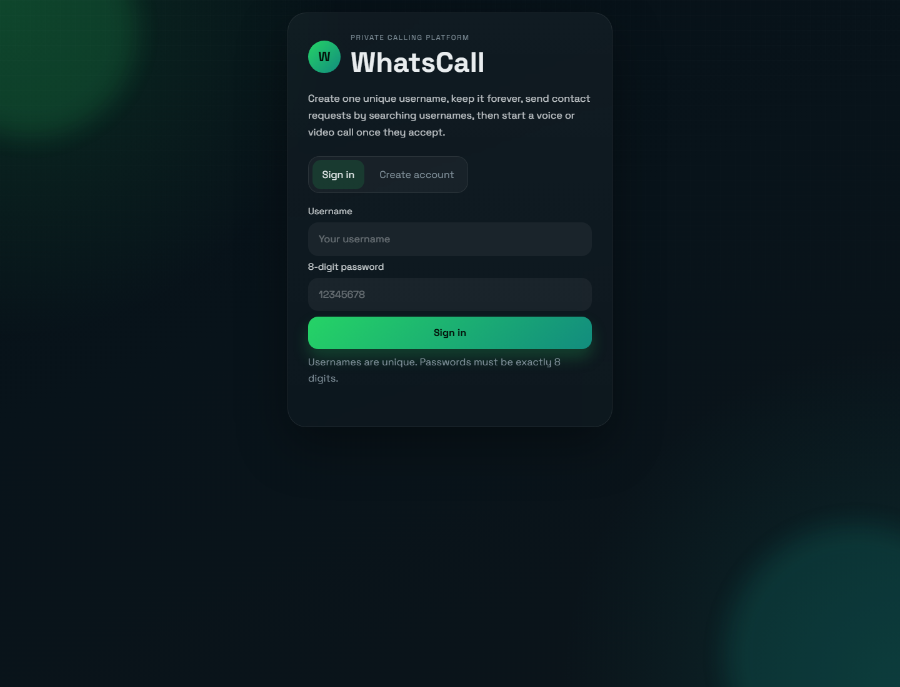
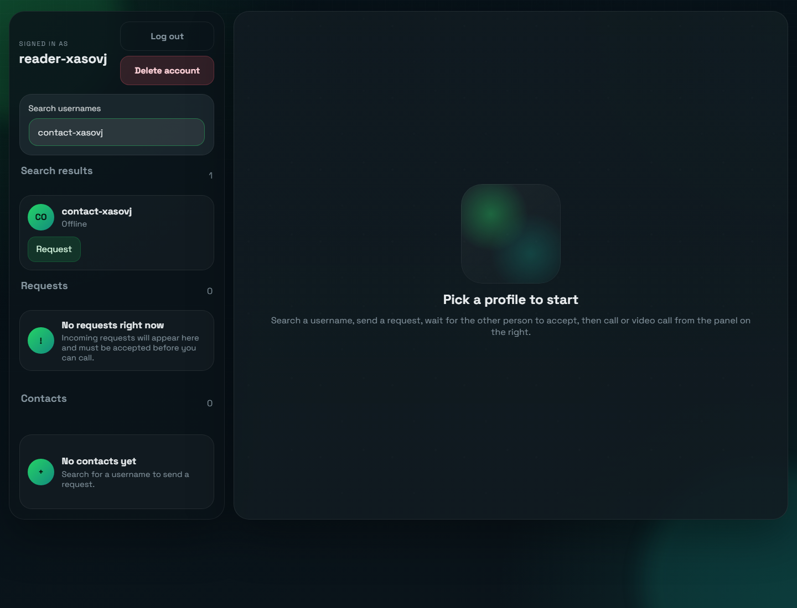
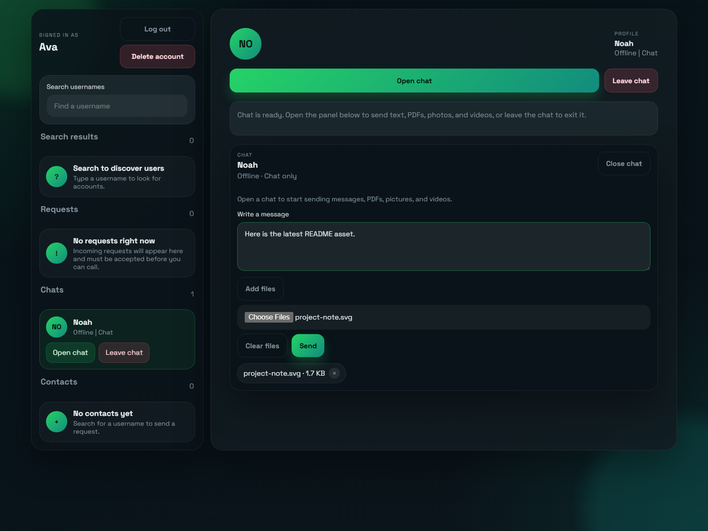
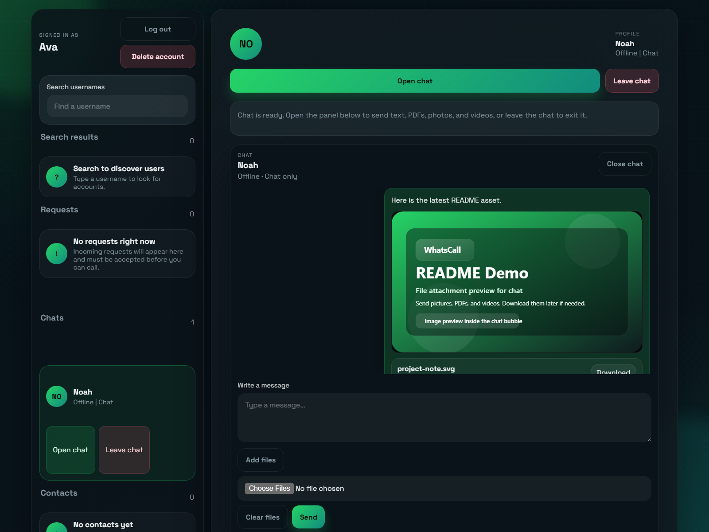
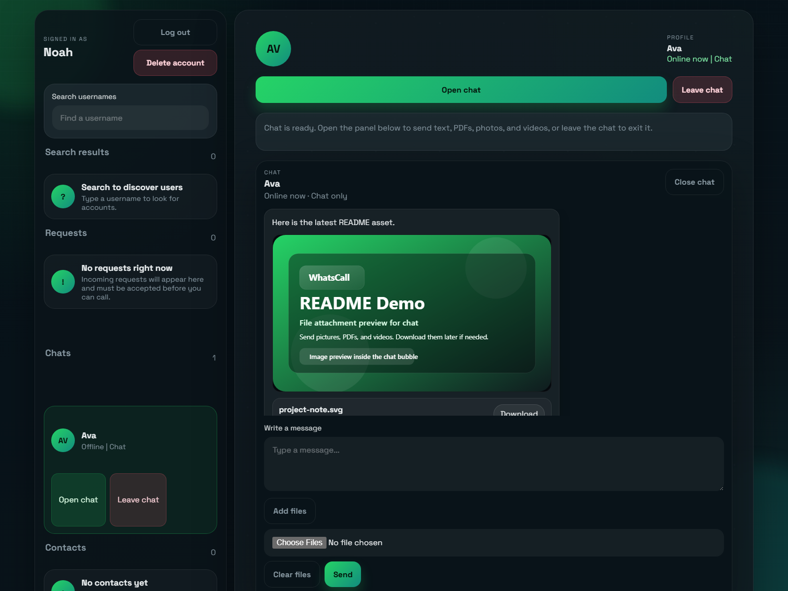
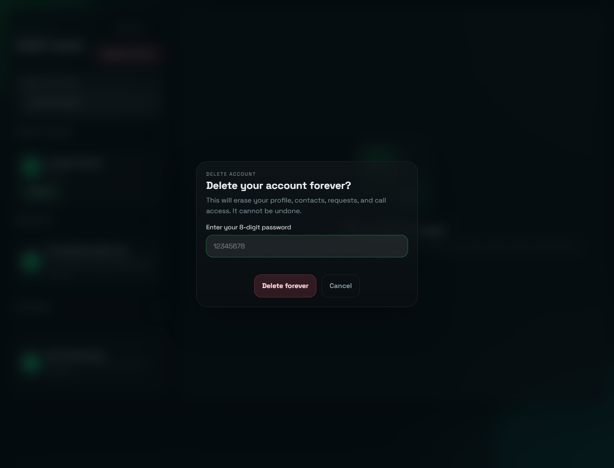

# WhatsCall

WhatsCall is a WhatsApp-style calling and chat platform built with Node.js, Express, Socket.IO, Multer, and WebRTC.
Users create one unique username with an 8-digit password, search other usernames, send separate contact and chat requests,
then call, video call, or message once the other person accepts.

## Features

- Unique username accounts with duplicate-name protection
- Sign in and create account with exactly 8-digit passwords
- Persistent storage in `data/users.json`
- Separate contact requests for calls and chat requests for messaging
- Search users by username
- Unread badges and live last-seen timestamps
- Profile photo, bio, and status editing
- Voice calls and video calls with accept/reject flow
- Mute and unmute during calls
- Turn video on and off during video calls
- Live call timer for both users
- Chat after acceptance with text, PDFs, pictures, and videos
- File previews, download buttons, and delete-message support
- Typing indicators and read receipts
- Leave a chat without deleting the account
- Delete account forever with password confirmation
- Remove a deleted account from all saved contacts, chats, and requests automatically
- WhatsApp-inspired dark, responsive UI

## Screenshots

### Sign In



### Dashboard Search



### Chat Composer



### Chat Thread, Sender View



### Chat Thread, Recipient View



### Delete Account



## Run Locally

1. Install dependencies:

```bash
npm install
```

2. Start the app:

```bash
npm start
```

3. Open the app in your browser:

```text
http://localhost:3001
```

If you want to use a different port, set the `PORT` environment variable before starting the server.
If `http://localhost:3000` is slow, busy, or not working, try `http://localhost:3001`.

## How to Use the Web App

WhatsCall has two separate approval flows:

- Contact requests are for calls.
- Chat requests are for messaging and file sharing.

1. Create or sign in to an account. Open the app and use the sign-in card. The app starts signed out each time it loads. If you create a new account, the username must be unique and the password must be exactly 8 digits.
2. Search for another user. Type a username into the search box on the left. Search results show whether the user is offline, already a contact, or waiting on a request.
3. Send a contact request. Click `Request` on the user card if you want to call that person later. The other person must accept before the contact is added.
4. Send a chat request. Click `Request chat` if you want to start messaging. The other person must accept before the chat opens.
5. Accept or reject requests. Incoming contact requests appear in the `Requests` section. Incoming chat requests appear in the `Chats` section until accepted. Accepting moves the profile into your contacts or chats. Rejecting removes the request.
6. Edit your profile. Click `Edit profile` to add a profile photo, bio, and status message. Your avatar, status, and last-seen text update across the app.
7. Open a chat. Once a chat is accepted, open the user from the `Chats` list or the profile panel. The chat panel appears on the right.
8. Send messages and files. Type a message or use `Add files` to attach files before sending. Supported files are PDFs, pictures, and videos. Your own messages show a `Delete` button, every attachment has a `Download` button, and read receipts appear after the other person opens the message.
9. Leave a chat when you are done. Use `Leave chat` to exit the conversation without deleting the account or the contact.
10. Start a call. Open a contact and use `Audio call` or `Video call`. The other person gets an incoming-call prompt and must accept before the call starts for both users.
11. Use call controls. During a call, use `Mute` and `Unmute` to control your microphone. During video calls, use `Video on` and `Video off` to control your camera.
12. Delete your account if needed. Click `Delete account`, enter your password, and confirm. This permanently deletes the account and removes it from other users' contacts, chats, and requests too.

## Browser Notes

- Create two different accounts in separate browser windows or profiles to test calls and live chat updates.
- Camera and microphone access require a browser that supports `getUserMedia`.
- For a real online deployment, serve the app over HTTPS so camera and microphone features work correctly.
- The UI is responsive, so it works on phones and smaller screens, but calls and uploads still feel best on desktop.

## Deployment Notes

WhatsCall can run over HTTPS if you provide TLS files when starting the server:

- `SSL_KEY_FILE` - path to your private key file
- `SSL_CERT_FILE` - path to your certificate file
- `SSL_CA_FILE` - optional certificate chain file

Example PowerShell launch:

```powershell
$env:PORT = 3001
$env:SSL_KEY_FILE = 'C:\certs\privkey.pem'
$env:SSL_CERT_FILE = 'C:\certs\fullchain.pem'
npm start
```

If `PORT` is already busy, the server will automatically try the next free port.

## Release to GitHub and Render

Use this checklist when you are ready to publish the project:

### 1. Push the code to GitHub

1. Create a new GitHub repository for WhatsCall.
2. From this project folder, commit your changes and push them to the `main` branch.
3. Keep `README.md` and `render.yaml` in the repository root so Render can read the deployment settings.

### 2. Create the Render service

1. Log in to Render and create a new Web Service from your GitHub repository.
2. Let Render use the included `render.yaml` blueprint, or set the service up manually with the same commands.
3. Use these settings if you configure the service by hand:
   - Build command: `npm install`
   - Start command: `npm start`
   - Health check path: `/`
4. Leave the `SSL_KEY_FILE` and `SSL_CERT_FILE` environment variables empty on Render unless you are bringing your own certificates. Render already serves the public app over HTTPS.

### 3. After deployment

1. Open the Render URL and make sure the sign-in screen loads.
2. Test account creation, search, contact requests, chat requests, voice calls, and video calls.
3. If you make changes later, push them to GitHub and Render will redeploy automatically when auto-deploy is enabled.
4. For a real-time app like WhatsCall, choose a Render plan that keeps the service awake if you want always-on chat and calling.

## Storage Notes

- Accounts are stored locally in `data/users.json`.
- Chat threads and uploaded attachments are stored locally in `data/chat-files/`.
- This makes the app easy to run locally, but for a production platform you should switch to a real database and persistent hosting.
- The app starts on the sign-in screen each time it loads, even though the account data remains saved until the user deletes it.

## Project Structure

- `server.js` - Express server, API routes, Socket.IO signaling, file uploads, and data persistence
- `public/index.html` - App layout and modals
- `public/app.js` - Client logic, auth flow, contacts, chats, and calling
- `public/styles.css` - WhatsApp-style interface styling
- `render.yaml` - Render Blueprint for GitHub-to-Render deployment
- `data/users.json` - Local account storage
- `data/chat-files/` - Uploaded chat attachments

## Go Online

- https://adhrit-talkbridge-new-v-two.onrender.com
